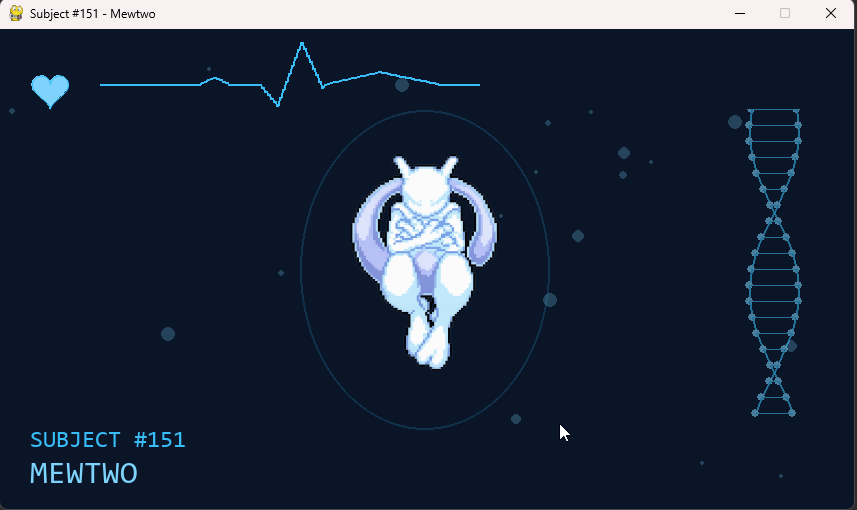

# Animación de monitoreo de Mewtwo

Pantalla vertical que contiene a Mewtwo en el centro, símbolo de ADN, burbujas flotantes, corazón latiendo y línea de electrocardiograma.




## Requisitos

- Python 3.8+
- pygame

## Instalación

```bash
pip install -r requirements.txt
```

## Ejecución

```bash
python main.py
```

## Imagen de Mewtwo

Coloca una imagen de Mewtwo en hibernación en `assets/mewtwo.png` para que aparezca en el centro. Si no existe el archivo, se mostrará un placeholder.

